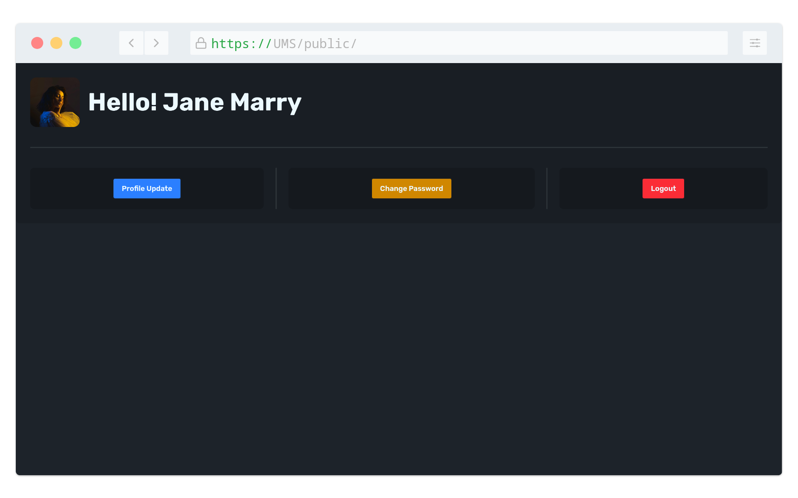
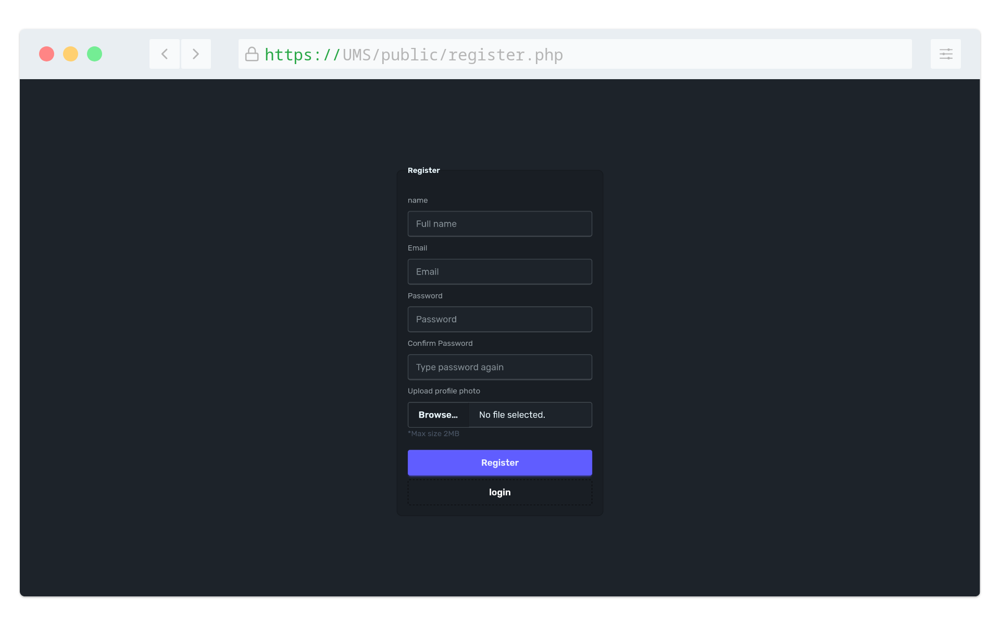
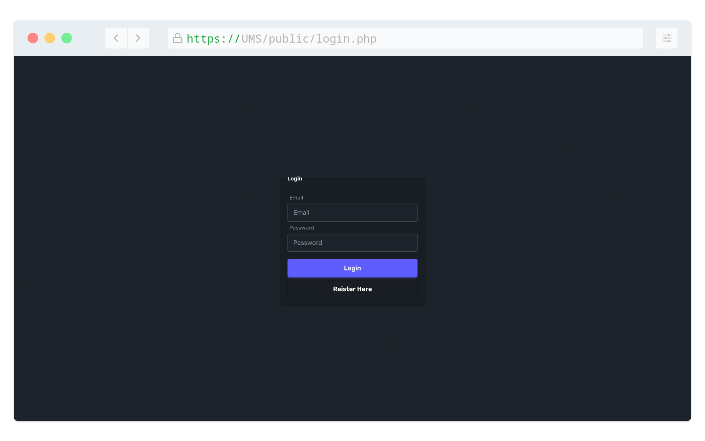
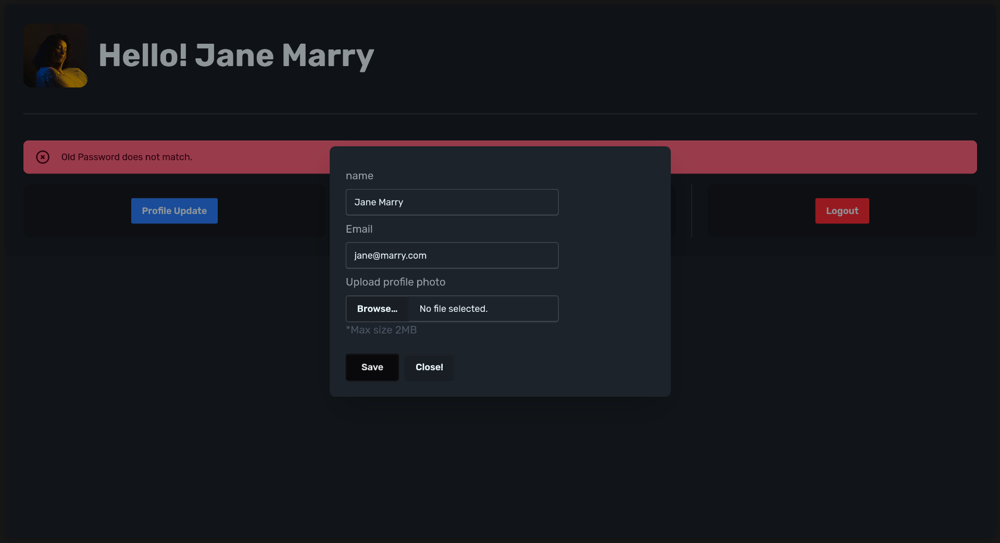
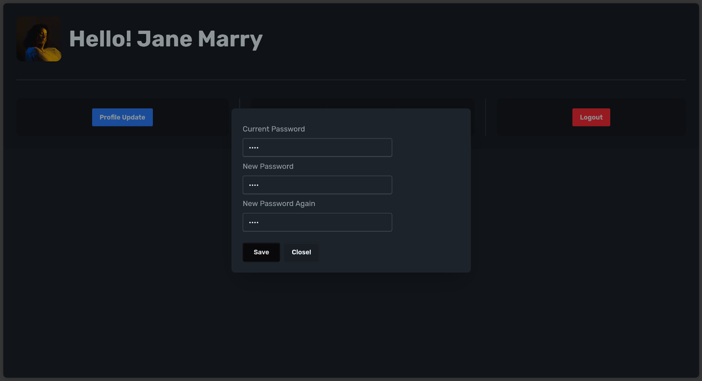
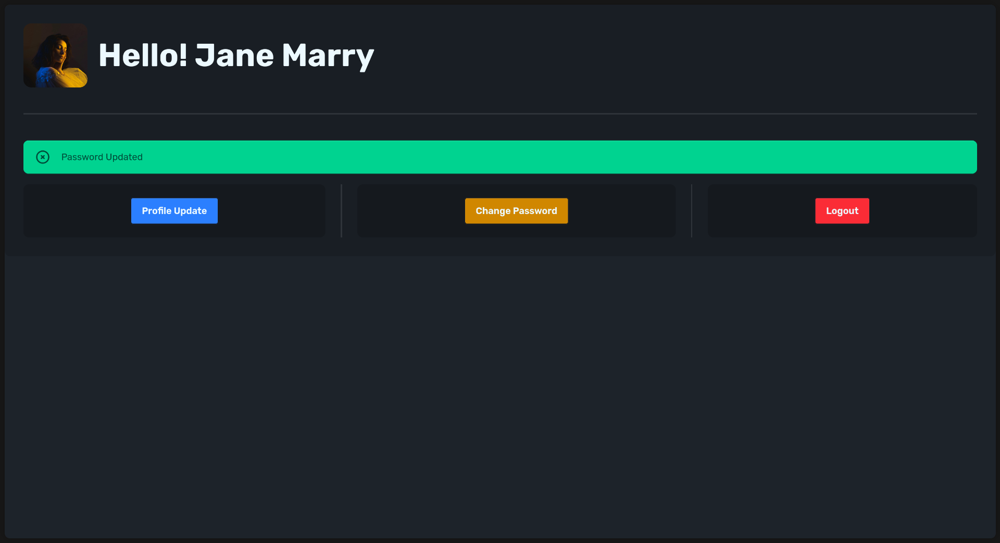
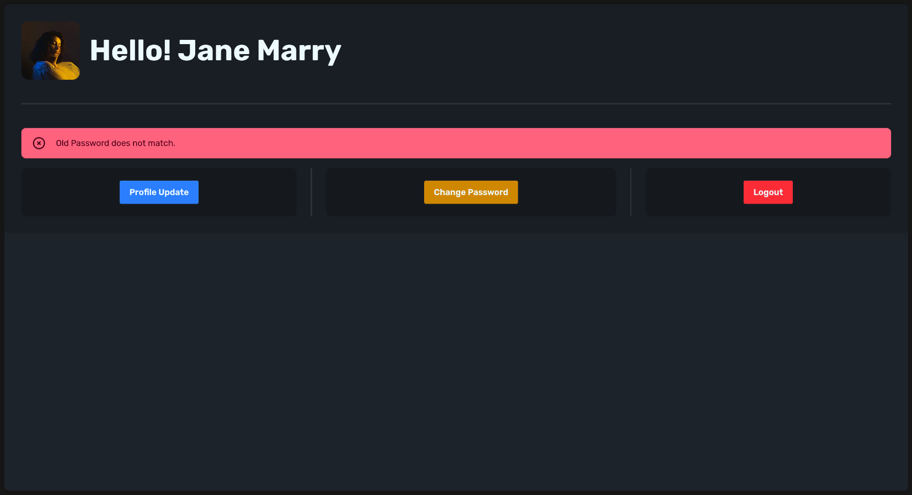

<a id="readme-top"></a>

# User Management System

A simple PHP web application that handles user authentication, profile update and logout with Session support.



<details>
  <summary>Table of Contents</summary>
  <ol>
    <li><a href="#tech-stack">Tech Stack</a></li>
    <li>
      <a href="#installation">Installation</a>
    </li>
    <li><a href="#usage">Usage</a></li>
    <li><a href="#contributing">Contributing</a></li>
    <li><a href="#contact">Contact</a></li>
    <li><a href="#acknowledgments">Acknowledgments</a></li>
  </ol>
</details>

## Features

- User Registration with:
  - Email, Username, Password, Profile Picture
  - Basic validation (email format, password, user exist or not, etc.)
- User Login
- Profile Update
  - Change email
  - Change name
  - Change profile picture
  - Change password
- Password hashing (using `password_hash`)
- Session-based authentication

<p align="right">(<a href="#readme-top">back to top</a>)</p>

## Tech Stack

- PHP (Vanilla)
- MySQL (with Mariadb)
- Tailwind with DaisyUI
- Apache server (XAMPP)
<p align="right">(<a href="#readme-top">back to top</a>)</p>

## Installation

### Clone this repo

```bash
# HTTPS
git clone https://github.com/kusowl/User-Management-System.git
```

or

```bash
#SSH
git clone git@github.com:kusowl/User-Management-System.git
```

### Move the folder to **htdocs** or start the php server

```bash
cp * path/to/htdocs
cd path/to/htdocs/UMS/
```
### Start the xampp 
In windows install xampp and start the server from control panel.
In linux follow the same. You can start the xampp from terminal also.

```bash
sudo xampp start
```

### Install the tailwind and DaisyUI library

```bash
npm install
```
or

```bash
npm install tailwindcss@4.1.4 @tailwindcss/cli@4.1.4 daisyui@5.0.27
```

### Start the css build process

```bash
npx @tailwindcss/cli -i app.css -o public/output.css --watch
```


### Setup the database

Create a database with MySQL and edit the credentials in **config.php**

```php
$conn = mysqli_connect("localhost", "root", "", "jphp21");

// Change it to

$conn = mysqli_connect("<hostname>", "<username>", "<password>", "<db_name>");

// And
$table = "ums";
// change it to
$table = "<table_name>";
```

<p align="right">(<a href="#readme-top">back to top</a>)</p>

## Usage

Register first in **public/register.php**


Then login in **public/login.php**


After login you can see the dashboard


There you can update profile, change password and logout.

### Profile Update



### Change Password





<p align="right">(<a href="#readme-top">back to top</a>)</p>

## Contributing

Contributions are what make the open source community such an amazing place to learn, inspire, and create. Any contributions you make are greatly appreciated.

If you have a suggestion that would make this better, please fork the repo and create a pull request. You can also simply open an issue with the tag "enhancement". Don't forget to give the project a star! Thanks again!

1. Fork the Project
2. Create your Feature Branch (`git checkout -b feature/AmazingFeature`)
3. Commit your Changes (`git commit -m 'Add some AmazingFeature'`)
4. Push to the Branch (`git push origin feature/AmazingFeature`)
5. Open a Pull Request

<p align="right">(<a href="#readme-top">back to top</a>)</p>

## Contact

Kushal Saha - [@linkedin](https://www.linkedin.com/in/kusowl/) - kushal.saha@outlook.com

Project Link: [https://github.com/kusowl/User-Management-System](https://github.com/kusowl/User-Management-System)

<p align="right">(<a href="#readme-top">back to top</a>)</p>

## Acknowledgments

- [Best-Readme-Template](https://github.com/othneildrew/Best-README-Template/tree/main)
